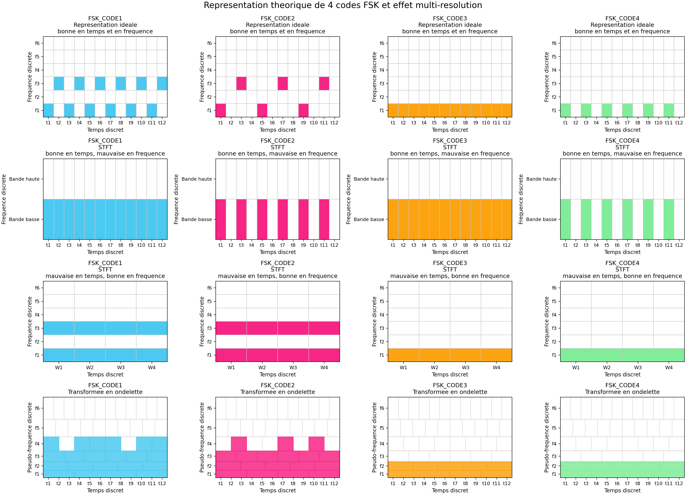

This figure is a simplified illustration of the resolution trade-off across time-frequency representations for four FSK codes. The first row shows idealized signal patterns. The second row corresponds to an STFT with good time resolution but poor frequency resolution, while the third row corresponds to an STFT with poor time resolution but good frequency resolution. The last row gives a simplified wavelet representation, with finer frequency resolution at low frequencies and finer time resolution at high frequencies. This toy example illustrates why combining two complementary STFTs can be more appropriate here than relying only on wavelets: the two STFTs provide two uniform and complementary tilings of the time-frequency plane for detection.
