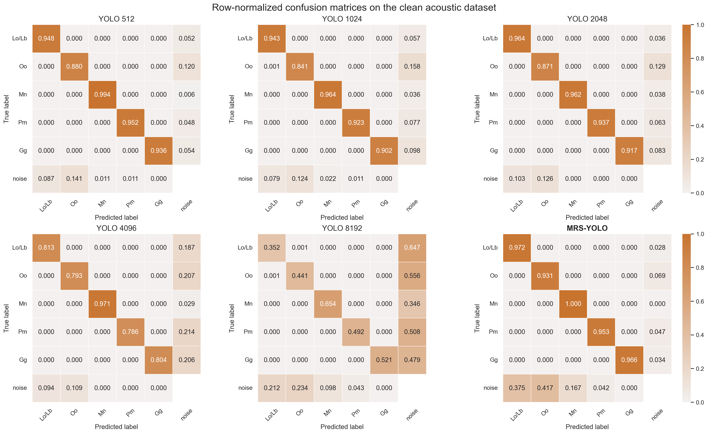
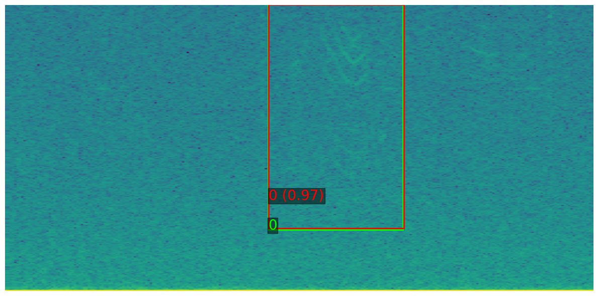
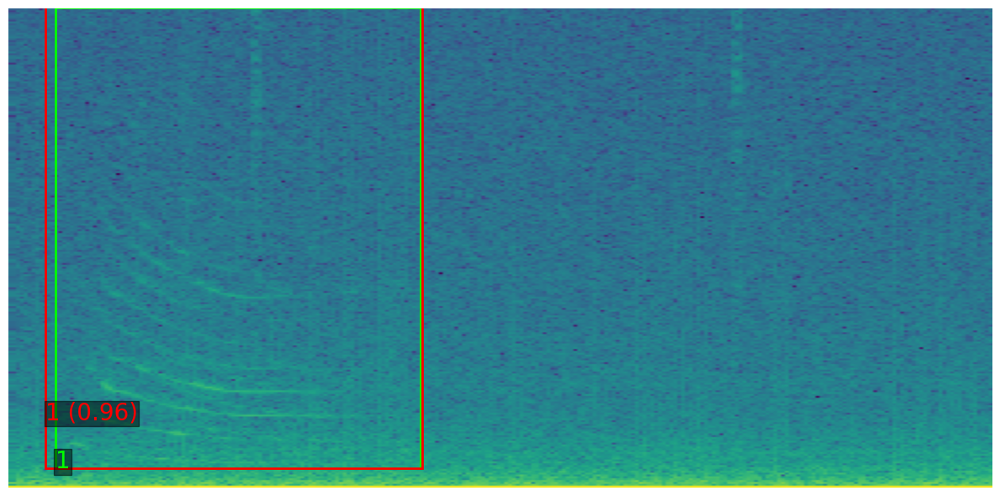
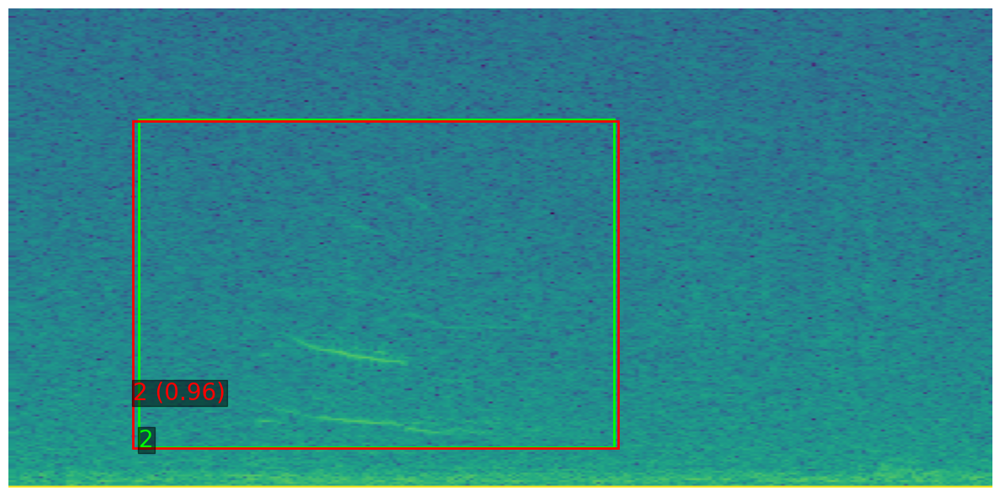
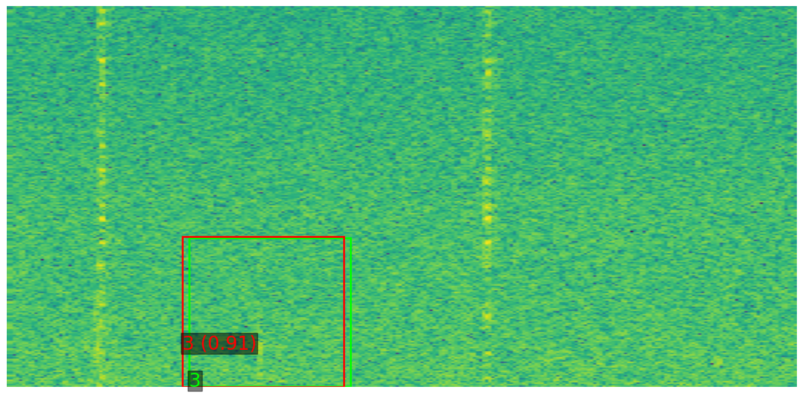

# Cross-Domain Validation on Real Hydrophone Data

All previous experiments were conducted on simulated RF interception datasets (Datasets A and B), specifically designed to control signal diversity, spectral congestion, and SNR conditions for systematic ablation. While these synthetic benchmarks allow rigorous architectural evaluation, they do not assess generalization to real-world data. To evaluate the broader applicability of `MRS-YOLO`, we therefore extend our study to a real hydrophone-based marine mammal dataset collected by Ocean Networks Canada (ONC) near Barkley Canyon (48.426°N, -126.174°W).

The dataset corresponds to a publicly available annotated marine acoustic corpus. Recordings were acquired using a seabed-mounted broadband hydrophone sampling continuously at 64 kSps (32 kHz effective bandwidth). The dataset spans approximately one year of duty-cycled recordings and contains 12,763 manually annotated marine mammal phonations from multiple cetacean species, including baleen whales (fin, blue, humpback), toothed whales (sperm whales, orcas), and several delphinid species (Pacific white-sided dolphins, Risso's dolphins, and others). Crucially, each annotation includes explicit time-frequency bounds, making the dataset directly compatible with spectrogram-based object detection frameworks.

This dataset is particularly relevant for evaluating multi-resolution architectures for three reasons:

- It represents real underwater acoustic conditions, including ambient ocean noise, anthropogenic interference, overlapping biological sources, and variable SNR, thereby providing a stringent cross-domain test from RF to bioacoustics.
- The original annotation protocol explicitly relied on multiple spectrogram configurations: different frequency bands required distinct STFT window lengths to ensure proper species identification. Low-frequency baleen whale calls require fine frequency resolution, whereas high-frequency odontocete clicks demand fine temporal resolution, with mid-frequency whistles falling between these regimes.
- Unlike many bioacoustic corpora that provide clip-level labels only, this dataset includes precise time-frequency bounding boxes, enabling structured detection and localization evaluation analogous to our RF experiments.

The objective of this cross-application experiment is not to derive new biological conclusions, but to assess whether the architectural advantages of explicit multi-resolution fusion extend beyond simulated RF scenarios to real acoustic data. This experiment thus serves as an external validation of the core design principles underlying `MRS-YOLO`.

## Preprocessing and Multi-Resolution Representation

Raw waveforms are segmented using a sliding temporal window with overlap to ensure dense coverage of annotated events. For each segment, five STFT resolutions are computed using window lengths `{512, 1024, 2048, 4096, 8192}` with 50% overlap.

Because full-band spectrograms at these resolutions would lead to very large tensors, the frequency axis is partitioned into four contiguous bands. The acquisition window length is selected such that the resulting time-frequency representations remain bounded to a maximum dimension of 1024 samples along either axis. Each sample therefore consists of a multi-resolution stack of spectrograms over a restricted frequency band, matching the architectural design of `MRS-YOLO`.

To ensure detection consistency, only segments containing at least one sufficiently covered annotation are retained. Specifically, a bounding box must have at least 80% of its temporal extent contained within the considered window. Bounding boxes whose normalized time or frequency span falls below minimal geometric thresholds are discarded to avoid degenerate detections. Spectrogram magnitudes are log-compressed and linearly normalized to `[0, 1]` per segment.

We further apply a conservative label filtering strategy. Annotations marked with taxonomic ambiguity, for example multiple possible species, are excluded, and only confidently attributed species labels are retained. This filtering step removes uncertain classes while preserving approximately 85% of the annotated data. After preprocessing, the dataset is split into training and validation subsets (80/20), providing a controlled yet representative benchmark for cross-domain evaluation.

For a given segment `x(t)`, additive white Gaussian noise `n(t)` is injected such that its relative noise power (RNP) satisfies:

$$
\mathrm{RNP}_{\mathrm{dB}} =
10 \log_{10} \left( \frac{\mathbb{E}[n^2(t)]}{\mathbb{E}[x^2(t)]} \right).
$$

The noise variance is therefore chosen as:

$$
\mathbb{E}[n^2(t)] =
\mathbb{E}[x^2(t)] \cdot 10^{\mathrm{RNP}_{\mathrm{dB}}/10},
$$

yielding a degraded signal:

$$
\tilde{x}(t) = x(t) + n(t).
$$

Three degradation regimes are constructed in addition to the initial dataset, corresponding to relative noise powers of `-20 dB` (medium degradation), `-15 dB` (strong degradation), and `-10 dB` (very strong degradation).

This controlled augmentation enables a systematic analysis of robustness under increasing noise levels while preserving identical annotations and preprocessing steps, thereby isolating the impact of signal degradation on detection performance.

## Detection Performance

The tables below report Recall at fixed precision (`>= 0.9`), `mAP@50`, and `mAP@50:95` for all single-resolution YOLO baselines and the proposed `MRS-YOLO` model across increasing noise conditions.

On the initial dataset without additional noise injection, `MRS-YOLO` achieves the best overall performance (`Recall@0.9P = 0.962`, `mAP@50 = 0.956`, `mAP@50:95 = 0.931`), consistently outperforming all single-resolution baselines. The strongest single-resolution configuration in terms of recall (`STFT window = 2048`, `Recall@0.9P = 0.941`) remains below the multi-resolution model, while the best mAP values among single-resolution models (`512` and `2048`) also remain inferior to `MRS-YOLO`. This confirms that multi-resolution fusion provides a measurable gain even in nominal conditions.

As noise intensity increases, performance degradation becomes pronounced for all models, but the gap progressively widens. Under moderate degradation, several single-resolution configurations exhibit sharp drops in mAP, whereas `MRS-YOLO` maintains substantially higher recall and mAP values. In the strong and very strong degradation regimes, most single-resolution baselines suffer severe performance collapse, particularly in `mAP@50:95`. In contrast, `MRS-YOLO` systematically preserves the highest recall and mAP across all regimes, even when absolute values become low due to extreme noise.

Overall, these results demonstrate that explicit multi-resolution fusion not only improves nominal detection performance but also significantly enhances robustness under progressively degraded acoustic conditions.

| Model (STFT window) | Initial R@0.9P | Initial mAP50 | Initial mAP50:95 | Moderate R@0.9P | Moderate mAP50 | Moderate mAP50:95 | Strong R@0.9P | Strong mAP50 | Strong mAP50:95 | Very strong R@0.9P | Very strong mAP50 | Very strong mAP50:95 |
| --- | ---: | ---: | ---: | ---: | ---: | ---: | ---: | ---: | ---: | ---: | ---: | ---: |
| YOLO (512) | 0.934 | 0.925 | 0.897 | 0.409 | 0.224 | 0.217 | 0.236 | 0.133 | 0.128 | 0.046 | 0.002 | 0.002 |
| YOLO (1024) | 0.921 | 0.903 | 0.876 | 0.374 | 0.408 | 0.371 | 0.242 | 0.268 | 0.248 | 0.126 | 0.102 | 0.097 |
| YOLO (2048) | 0.941 | 0.934 | 0.886 | 0.375 | 0.032 | 0.030 | 0.199 | 0.010 | 0.009 | 0.132 | 0.068 | 0.062 |
| YOLO (4096) | 0.854 | 0.833 | 0.696 | 0.280 | 0.017 | 0.016 | 0.192 | 0.147 | 0.130 | 0.109 | 0.000 | 0.000 |
| YOLO (8192) | 0.368 | 0.440 | 0.284 | 0.105 | 0.069 | 0.055 | 0.065 | 0.012 | 0.011 | 0.035 | 0.019 | 0.016 |
| **MRS-YOLO** | **0.962** | **0.956** | **0.931** | **0.591** | **0.589** | **0.563** | **0.463** | **0.458** | **0.431** | **0.247** | **0.008** | **0.007** |

## Confusion Matrix Analysis

A first notable observation is the near absence of inter-class confusion across most models and resolutions. Off-diagonal entries, excluding the noise column, remain almost zero from the smallest to the intermediate STFT windows, indicating that when detections occur, species are rarely confused with one another. Errors predominantly correspond to missed detections absorbed into the noise class, rather than misclassification between biological classes.

However, performance strongly depends on the STFT resolution. While configurations from 512 to 2048 exhibit high diagonal dominance, larger windows show a noticeable degradation in detection probability across all classes. This degradation becomes particularly severe at 4096 and 8192, where recall drops substantially for every biological class and a large proportion of samples are assigned to noise. This confirms that excessively large windows reduce discriminative capacity on the initial dataset.

The primary difference between models therefore lies in detection probability, that is, diagonal terms, not class discrimination. Comparing diagonal entries, `MRS-YOLO` consistently achieves the highest per-class recall for most classes.

Relative to the best single-resolution configuration for each class, `MRS-YOLO` improves detection probability by:

- **Delphinidae (Lo/Lb pooled class)**: `97.2%` vs `96.4%`, a gain of **+0.8 percentage points**
- **Orcinus orca (Oo)**: `93.1%` vs `88.0%`, a gain of **+5.1 points**
- **Megaptera novaeangliae (Mn, humpback whale)**: `100.0%` vs `99.4%`, a gain of **+0.6 points**
- **Physeter macrocephalus (Pm, sperm whale)**: `95.3%` vs `95.2%`, a marginal gain of **+0.1 points**
- **Grampus griseus (Gg, Risso's dolphin)**: `96.6%` vs `93.6%`, a gain of **+3 points**.

Overall, the multi-resolution model provides consistent gains for the five biological classes, particularly for *Orcinus orca*, while maintaining near-perfect discrimination for *Megaptera novaeangliae*. 

Row-normalized confusion matrices on the clean acoustic dataset.

## Processing Time

Computational efficiency must also be considered with respect to real-time deployment. Each acoustic acquisition lasts `300 s`, while a single spectrogram covers a temporal window of `16.384 s`. Since the frequency axis is partitioned into four contiguous bands, each temporal window produces four spectrograms processed sequentially by the model. Due to the `50%` temporal overlap between successive windows, the effective stride is `8.192 s` for real-time operation.

In addition to model inference, multi-resolution spectrogram computation must be considered. The full five-resolution STFT stack requires `2.359 ms` on CPU and `0.435 ms` on an NVIDIA H100 GPU. The proposed `MRS-YOLO` model achieves an average inference time of `0.792 ms` per spectrogram on H100 and `151 ms` on CPU. Processing the four frequency bands sequentially therefore requires `3.168 ms` for inference alone, and `3.603 ms` including STFT computation, on GPU. On CPU, the total processing time amounts to `606.359 ms`.

These total processing times remain significantly below the effective real-time constraint of `8.192 s` imposed by the overlap, ensuring that the system can operate comfortably in real time, even on CPU-only hardware. This confirms the practical feasibility of multi-resolution detection for continuous passive acoustic monitoring scenarios.

## Discussion

Several important elements must be considered when interpreting these results.

First, all annotations in this dataset were produced manually through audio-visual inspection. While this ensures high biological validity, it also introduces unavoidable approximation in the time-frequency bounding boxes. In practice, manual annotations may be temporally or spectrally over-extended, may truncate faint signal components, or may not perfectly align with the most energetic region of the call. As a consequence, strict localization metrics based on high IoU thresholds can penalize predictions that are visually and biologically accurate, yet more tightly aligned with the true signal structure than the original human annotation. For this reason, recall is evaluated at an IoU threshold of `0.5`. Empirically, increasing the IoU threshold often leads to rejecting detections that are in fact well localized, and in some cases more precisely delimited than the manual bounding boxes.

Second, the introduction of controlled waveform-level degradation through additive noise directly impacts interpretability. At lower degradation levels, some segments become barely distinguishable even to a human operator when visualized as spectrograms. Consequently, certain detections counted as false alarms may in fact correspond to weak or previously unnoticed biological events that were not annotated due to low perceptual saliency during manual review.

Therefore, the reported false alarm behavior must be interpreted with caution. In highly degraded regimes, part of the apparent performance degradation may reflect limitations of the reference annotations rather than purely model errors. From an operational perspective, this observation reinforces the relevance of multi-resolution representations, as they may enhance the detectability of faint structures that are otherwise difficult to annotate reliably.

Third, unlike previously considered datasets A and B, the present dataset is comparatively less dense in terms of simultaneous acoustic activity. Most annotated segments contain a single species per spectrogram, although multiple calls from the same species may occur within a segment. This reduced inter-species overlap could suggest that a classical image-level classification approach, for example a ResNet-based spectrogram classifier, might be sufficient for species identification.

Beyond species identification, a detection framework provides explicit time-frequency localization of individual calls within each spectrogram. This localization enables precise characterization of signal duration, bandwidth, and spectral structure. Importantly, the availability of time-frequency bounding boxes facilitates downstream biological analyses that extend beyond species-level labeling. In particular, localized detections allow finer-grained investigation of call sub-types or echo-types and may support more detailed behavioral or ecological interpretation. In contrast, a global classification model collapses the entire spectrogram into a single label, thereby discarding spatial structure and preventing signal-level characterization.

Therefore, even in relatively sparse acoustic conditions, the detection paradigm provides additional analytical value that extends beyond species-level recognition, as illustrated by the representative qualitative examples below.

## Qualitative Examples

Qualitative detection examples on real hydrophone data obtained with the proposed `MRS-YOLO` model are shown below. Although the model operates on a multi-resolution representation, detections are visualized here on a single spectrogram resolution (`512 x 512`) for clarity. For each example, the ground-truth bounding box and class index are shown in green, while the predicted bounding box, predicted class, and confidence score are shown in red.

### Delphinidae (Lo/Lb)

### *Orcinus orca* (Oo)

### *Megaptera novaeangliae* (Mn)

### *Physeter macrocephalus* (Pm)

