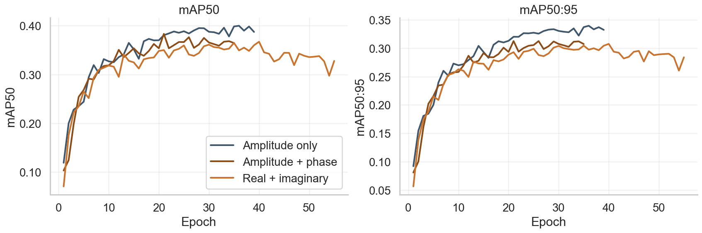
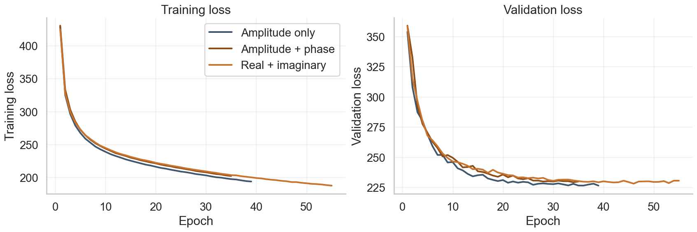
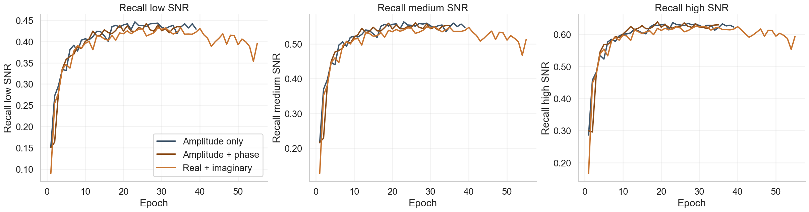

# Detailed Response to Reviewer 7cmh on W2

## W2. Questionable necessity of the multi-resolution motivation

We agree that, in theory, the complex-valued STFT representation preserves the full information content of the original signal. This naturally raises the question of whether the choice of STFT window size truly impacts the representation, and whether a single complex spectrum should be sufficient.

From a signal detection perspective, this question can be further clarified. In classical detection theory, when dealing with an unknown signal embedded in noise, the Generalized Likelihood Ratio Test (GLRT) leads to a decision rule based primarily on the signal amplitude, without explicitly exploiting phase information [1]. This suggests that, under a fully unknown signal hypothesis, phase may not be necessary for detection. However, this assumption no longer holds in a learning-based framework. A trained neural network implicitly incorporates prior knowledge from the data distribution, relaxing the “unknown signal” hypothesis. In this context, phase information can become informative.

Following this reasoning, one may consider directly processing the complex spectrogram instead of introducing a multi-resolution framework. Two main strategies are commonly explored in the literature:

- **(i) Real-valued networks using real and imaginary parts as separate channels.**

  In this approach, the complex spectrogram is decomposed into its real and imaginary components, which are treated as two input channels for a standard CNN. This paradigm is widely adopted as it preserves compatibility with real-valued architectures and benefits from stable training procedures.

  For instance, prior work on complex spectral mapping, complex spectrogram enhancement, and complex ratio masking treats real and imaginary parts as explicit channels or jointly models magnitude and phase, and reports benefits from exploiting richer spectral structure [2, 3, 4]. This literature suggests that including phase-related information can be beneficial in some settings.

  We propose an evaluation of this approach by feeding amplitude and phase (or equivalently real and imaginary components) as separate channels. The corresponding single-resolution comparison is summarized below:

  | Representation | mAP50:95 | mAP50 | Recall low SNR | Recall medium SNR | Recall high SNR | Params | FLOPs |
  | --- | ---: | ---: | ---: | ---: | ---: | ---: | ---: |
  | Amplitude only | 0.3396 | 0.3999 | 0.4420 | 0.5599 | 0.6327 | 2.88M | 629.64M |
  | Amplitude + phase | 0.3127 | 0.3833 | 0.4369 | 0.5551 | 0.6305 | 2.88M | 632.00M |
  | Real + imaginary | 0.3077 | 0.3671 | 0.4308 | 0.5475 | 0.6239 | 2.88M | 632.00M |

  This ablation shows that, in our setting, providing the complex spectrum explicitly does not improve over amplitude alone. This supports our claim that simply exposing phase information is not sufficient for effective exploitation in our detection setting.

  The same conclusion is visible when looking at the training dynamics across epochs. For completeness, we include below the corresponding curves for mAP, loss, and recall:

  

  

  

- **(ii) Complex-valued neural networks.**

  A more principled alternative consists in designing neural networks that operate directly in the complex domain. As discussed in the survey literature [5], such models offer a theoretically appealing framework but introduce practical challenges. In particular, they suffer from numerical instability during training.

  In the context of object detection, CV-YOLO [6] proposes a complex-valued extension of YOLO for SAR image analysis. Their results indicate that complex-valued modeling can provide improvements (approximately +1.4% mAP50 and +0.5% mAP50:95) compared to real-valued models with a similar number of parameters. However, this gain comes at a significant computational cost, with FLOPs roughly doubling due to complex-valued operations.

Overall, these observations suggest that while complex representations are theoretically complete and potentially beneficial, current convolutional neural networks struggle to effectively exploit phase information in practice. By leveraging multiple time-frequency resolutions, we expose the network to complementary structures that are more readily exploitable than raw phase information. Therefore, the proposed approach does not contradict the theoretical completeness of the STFT, but instead introduces a **meaningful inductive bias** that improves learning efficiency and robustness in realistic detection scenarios.

## References

[1] H. Vincent Poor, *An Introduction to Signal Detection and Estimation*. Springer Science & Business Media, 2013.

[2] L. Zhou, Y. Gao, Z. Wang, J. Li, and W. Zhang, “Complex spectral mapping with attention based convolution recurrent neural network for speech enhancement,” *arXiv preprint arXiv:2104.05267*, 2021.

[3] Szu-Wei Fu, Ting-Yao Hu, Yu Tsao, and Xugang Lu, “Complex spectrogram enhancement by convolutional neural network with multi-metrics learning,” in *2017 IEEE 27th International Workshop on Machine Learning for Signal Processing (MLSP)*, pp. 1-6, IEEE, 2017.

[4] Donald S. Williamson, Yuxuan Wang, and DeLiang Wang, “Complex ratio masking for joint enhancement of magnitude and phase,” in *2016 IEEE International Conference on Acoustics, Speech and Signal Processing (ICASSP)*, pp. 5220-5224, IEEE, 2016. DOI: 10.1109/ICASSP.2016.7472673.

[5] ChiYan Lee, Hideyuki Hasegawa, and Shangce Gao, “Complex-valued neural networks: A comprehensive survey,” *IEEE/CAA Journal of Automatica Sinica*, vol. 9, no. 8, pp. 1406-1426, 2022.

[6] Dandan Zhao, Zhe Zhang, Dongdong Lu, Xiaolan Qiu, Wei Li, Hang Li, and Yirong Wu, “CV-YOLO: A complex-valued convolutional neural network for oriented ship detection in single-polarization single-look complex SAR images,” *Remote Sensing*, vol. 17, no. 8, p. 1478, 2025.
